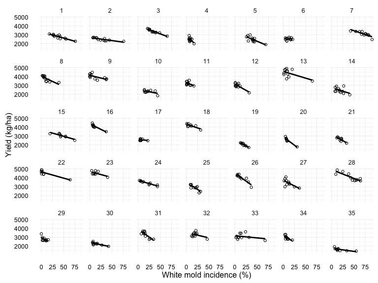
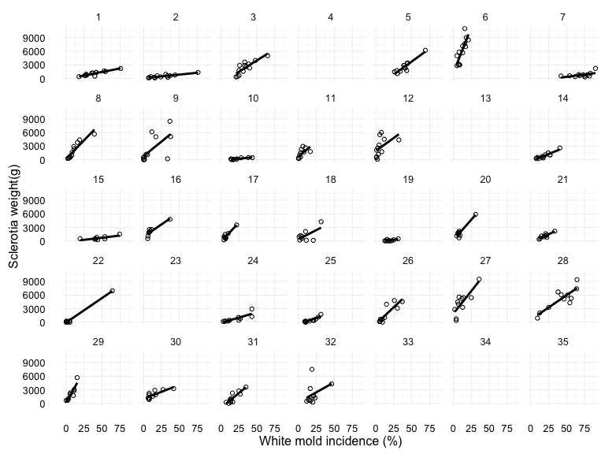
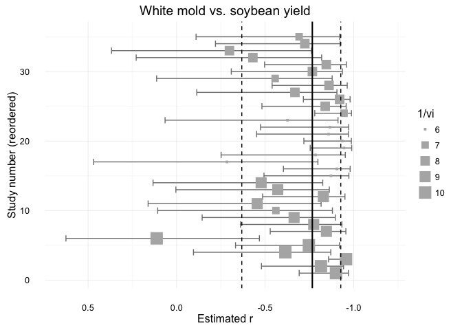
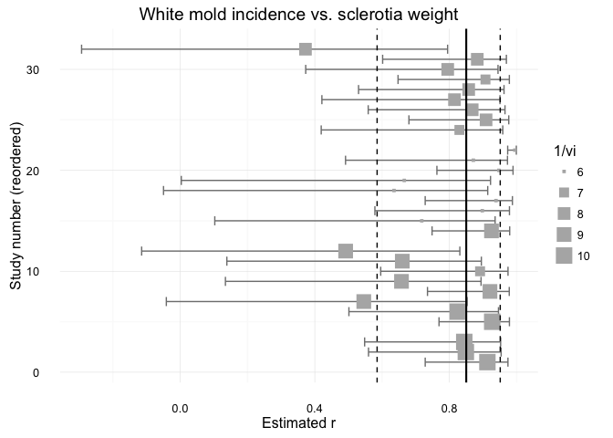

# Meta-analysis of relationships in soybean white mould
  
Last update: 9/29/2016  
<style>
body 
{
margin:0px;
padding:0px;
width:100%;
font-size: 1.8em;
line-height: 150%
}

h1, h2
{
margin-bottom: 30px;
marting-top: 40px
}

</style>


# Introduction

This report allows for reproducing the meta-analysis conducted in one of our articles published in Plant Pathology. 


> Lehner, M. S., Pethybridge, S. J., Meyer, M. C., & Del Ponte, E. M. (2016). Meta-analytic modelling of the incidence-yield and incidence-sclerotial production relationships in soybean white mould epidemics. Plant Pathol. doi:10.1111/ppa.12590

In the paper, we studied the relationships between soybean white mold incidence (inc) and soybean yield (yld) and inc and sclerotia weight (scl) assessed in 35 uniform field trials across several locations and four years in Brazil. The original data was obtained from individual tables for each trial published in a scientific report. 

These relationships were summarized using meta-analytical approaches. The effect-sizes which were summarized were the Pearson's correlation coefficient and the intercept and slopes of random coefficients model fitted to the data of 35 and 29 studies for the inc-yld and inc-scl relationships, respectively. 

Find below the commented code for  reproducing the analysis conducted in the paper. The data and code of this document are available for download in this [GitHub repository](https://github.com/emdelponte/paper-white-mold-meta-analysis). Be sure to install and load packages necessary for conducting the analysis. The plots used in this report were made using the base R graphics and ggplot2. Most of the plots are simple versions quick visualization, not actually formatted for final publishing.


```r
library(tidyverse)
library(broom)
library(tidyr)
library(cowplot)
```


# Data import 

The data was organized in the long format with each row representing a single treatment of a trial. Let's import and create the `dat_yld` data frame in a tidy format, with data grouped by study. Let's look at the structure of the object and the types of variables. 


```r
dat_yld <- read_csv("dat-white-mold-br.csv") %>% 
  group_by(study)
```

Here is the structure of the dataset and the first variables of a total of 17 variables Download the original [dat-white-mold-br.csv](dat-white-mold-br.csv) file.


```r
dat_yld
```

```
## Source: local data frame [382 x 17]
## Groups: study [35]
## 
##    study treat    season harvest_year  location state country elevation
##    <int> <int>     <chr>        <int>     <chr> <chr>   <chr>     <int>
## 1      9     1 2009/2010         2010 Agua Fria    GO  Brazil       891
## 2      9     2 2009/2010         2010 Agua Fria    GO  Brazil       891
## 3      9     3 2009/2010         2010 Agua Fria    GO  Brazil       891
## 4      9     4 2009/2010         2010 Agua Fria    GO  Brazil       891
## 5      9     5 2009/2010         2010 Agua Fria    GO  Brazil       891
## 6      9     6 2009/2010         2010 Agua Fria    GO  Brazil       891
## 7      9     7 2009/2010         2010 Agua Fria    GO  Brazil       891
## 8      9     8 2009/2010         2010 Agua Fria    GO  Brazil       891
## 9      9     9 2009/2010         2010 Agua Fria    GO  Brazil       891
## 10     9    10 2009/2010         2010 Agua Fria    GO  Brazil       891
## # ... with 372 more rows, and 9 more variables: region <chr>,
## #   elevation_class <chr>, inc_check <dbl>, inc_class <chr>,
## #   yld_check <dbl>, yld_class <chr>, inc <dbl>, scl <int>, yld <dbl>
```


# Data visualizaton

Let's have a look at the distribution of the three variables of interest, which will be used to obtain the effect-sizes for the meta-analysis.


```r
par(mfrow= c(1,3))
hist(dat_yld$inc, main = "Incidence")
hist(dat_yld$yld, main =  "Yield")
hist(dat_yld$scl, main = "Sclerotia weight")
```

<!-- -->

Now we want to visualize the two relationships of interest for each study. We add the line of the regression of linear model fitted to the data.


```r
library(ggplot2)
library(ggthemes)
ggplot(dat_yld, aes(inc, yld))+
       geom_point(shape = 1)+
       stat_smooth(method = lm, se = F, col = "black")+
       ylab("Yield (kg/ha)")+
       xlab("White mold incidence (%)")+
       theme_minimal()+
       facet_wrap(~ study, ncol = 7, scales = "fixed") 
```

<!-- -->

```r
ggplot(dat_yld, aes(inc, scl))+
       geom_point(shape = 1)+
       stat_smooth(method = lm, se = F, col = "black")+
       ylab("Sclerotia weight(g)")+
       xlab("White mold incidence (%)")+
       theme_minimal()+
       facet_wrap(~ study, ncol = 7, scales = "fixed") 
```

<!-- -->


# Meta-analytic models 

## Inc-yld relationship

### Correlation coefficient

Let's use the `do` function of the `dplyr` and `tidy` function of the `broom` package to extract the correlation statistics conditioned to study.


```r
cor_yld_inc <- dat_yld %>% 
  do(tidy(cor.test(.$inc, .$yld)))
```

Let's extract the first rows for each of the original dataset and then combine with the cor_yld_inc dataframe with the statistics by study.


```r
dat_yld2 <- filter(dat_yld, row_number() == 1)
dat_yld3 <- full_join(cor_yld_inc, dat_yld2, 
                      by = "study") %>% 
           mutate(n = parameter + 2)  
# create variable with the number of data points in the correlation
```

The Fisher's Z (yi) will be used as the effect size, due to its better statistical property than the Pearson's. We obtain Z (yi) and sampling variance (vi) using the `escalc` function of the `metafor` package and add to the dataframe.


```r
library(metafor)
dat_yld3 <- escalc(measure = "ZCOR", ri = estimate, ni = n, data = dat_yld3)
```

### Overall effect

Now we fit a random-coefficients model to estimate overal Fisher's Z using a maximum likelihood estimation method. Note that the effec-size and sampling variance are denoted by `yi` and `vi` (the standard notations used in `metafor`).


```r
ma_cor_yld <- rma.uni(yi, vi, method = "ML", data = dat_yld3)
summary(ma_cor_yld)
```

```
## 
## Random-Effects Model (k = 35; tau^2 estimator: ML)
## 
##   logLik  deviance       AIC       BIC      AICc  
## -23.1897   53.8742   50.3794   53.4901   50.7544  
## 
## tau^2 (estimated amount of total heterogeneity): 0.0953 (SE = 0.0531)
## tau (square root of estimated tau^2 value):      0.3087
## I^2 (total heterogeneity / total variability):   42.97%
## H^2 (total variability / sampling variability):  1.75
## 
## Test for Heterogeneity: 
## Q(df = 34) = 61.1764, p-val = 0.0029
## 
## Model Results:
## 
## estimate       se     zval     pval    ci.lb    ci.ub          
##  -1.0111   0.0799 -12.6553   <.0001  -1.1677  -0.8545      *** 
## 
## ---
## Signif. codes:  0 '***' 0.001 '**' 0.01 '*' 0.05 '.' 0.1 ' ' 1
```

We need  back-transformed z to obtain r


```r
pred_r <- predict(ma_cor_yld, transf = transf.ztor)
pred_r
```

```
##     pred   ci.lb   ci.ub   cr.lb   cr.ub
##  -0.7662 -0.8235 -0.6934 -0.9269 -0.3681
```


### Effect of moderators


```r
# season
ma_cor_yld_year <- rma(yi, vi, mods = ~season, method = "ML",   data = dat_yld3)

## region
ma_cor_yld_region <- rma(yi, vi, mods = ~region, method = "ML",data = dat_yld3)

## elevation as continuous
ma_cor_yld_elevation <- rma(yi, vi, mods = ~elevation, method = "ML", data = dat_yld3)

## elevation as category
ma_cor_yld_elevation2 <- rma(yi, vi, mods = ~elevation_class, method = "ML", data = dat_yld3)

## incidence in the check as continuous
ma_cor_yld_inc <- rma(yi, vi, mods = ~inc_check, method = "ML", data = dat_yld3)

## incidence in the check as categorical
ma_cor_yld_inc2 <- rma(yi, vi, mods = ~inc_class, method = "ML", data = dat_yld3)

## yield in the check as continuous
ma_cor_yld_yld <- rma(yi, vi, mods = ~yld_check, method = "ML", data = dat_yld3)

## yield in the check as categorical
ma_cor_yld_yld2 <- rma(yi, vi, mods = ~yld_class, method = "ML", data = dat_yld3)
```

Table. Q-test and significant of the effect of moderators

| Moderator |  Q-test |  P-value |
| ----------| -------| ----------|
| Season | 0.0030297 | 0.4612331|
| Region | 0.0031956 | 0.3253424|
| Elevation categorical | 0.003549 | 0.2620535|
| Elevation continuous | 0.0020817 | 0.8234688|
| Incidence categorical | 0.0097128 | 0.0604829|
| Yield continous | 0.0020552 | 0.7088088|
| Yield categorical | 0.0020952 | 0.7088088|


### Forrest plot of Pearson's r


```r
dat_yld3 %>% 
  ggplot(aes(x = study, y = estimate)) + 
  geom_errorbar(aes(ymin = conf.low, ymax = conf.high), color="grey50") + 
  geom_point(aes(size = 1/vi), shape = 15, color="grey70") +
  geom_hline(yintercept =pred_r$pred, size=0.75)+
  geom_hline(yintercept = c(pred_r$cr.lb, pred_r$cr.ub), linetype="dashed")+ 
  coord_flip()+
  scale_y_reverse(limits = c(0.65,-1.2))+
  labs(x = "Slope") + 
  theme_minimal() + 
  labs(size = "1/vi", 
       title = "White mold vs. soybean yield", 
        y = "Estimated r", x = "Study number (reordered)")
```

<!-- -->


## Inc-scl relationship


### Correlation coefficient


```r
cor_scl_inc <- dat_yld %>% 
 na.omit(dat_yld)%>%
  do(tidy(cor.test(.$inc, .$scl)))
```

Let's extract the first rows for each of the original dataset and then combine with the cor_yld_inc dataframe with the statistics by study.


```r
dat_scl2 <- filter(dat_yld, row_number() == 1) %>% 
            na.omit(dat_scl)
dat_scl3 <- full_join(cor_scl_inc, dat_scl2, 
                      by = "study") %>% 
           mutate(n = parameter + 2)  
# create variable with the number of data points in the correlation
```

The Fisher's Z (yi) will be used as the effect size, due to its better statistical property than the Pearson's. We obtain Z (yi) and sampling variance (vi) using the `escalc` function of the `metafor` package and add to the dataframe.


```r
library(metafor)
dat_scl3 <- escalc(measure = "ZCOR", ri = estimate, ni = n, data = dat_scl3)
```

#### Overall effect

Now we fit a random-coefficients model to estimate overal Fisher's Z using a maximum likelihood estimation method. Note that the effec-size and sampling variance are denoted by `yi` and `vi` (the standard notations used in `metafor`).


```r
ma_cor_scl <- rma.uni(yi, vi, method = "ML", data = dat_scl3)
summary(ma_cor_scl)
```

```
## 
## Random-Effects Model (k = 29; tau^2 estimator: ML)
## 
##   logLik  deviance       AIC       BIC      AICc  
## -19.4014   44.9285   42.8028   45.5374   43.2643  
## 
## tau^2 (estimated amount of total heterogeneity): 0.0822 (SE = 0.0549)
## tau (square root of estimated tau^2 value):      0.2866
## I^2 (total heterogeneity / total variability):   39.32%
## H^2 (total variability / sampling variability):  1.65
## 
## Test for Heterogeneity: 
## Q(df = 28) = 48.7514, p-val = 0.0089
## 
## Model Results:
## 
## estimate       se     zval     pval    ci.lb    ci.ub          
##   1.2564   0.0852  14.7462   <.0001   1.0894   1.4234      *** 
## 
## ---
## Signif. codes:  0 '***' 0.001 '**' 0.01 '*' 0.05 '.' 0.1 ' ' 1
```

We need  back-transformed z to obtain r


```r
pred_r_scl <- predict(ma_cor_scl, transf = transf.ztor)
pred_r_scl
```

```
##    pred  ci.lb  ci.ub  cr.lb  cr.ub
##  0.8501 0.7967 0.8903 0.5851 0.9510
```


#### Effect of moderators


```r
# season
ma_cor_scl_year <- rma(yi, vi, mods = ~season, method = "ML",   data = dat_scl3)

## region
ma_cor_scl_region <- rma(yi, vi, mods = ~region, method = "ML",data = dat_scl3)

## elevation as continuous
ma_cor_scl_elevation <- rma(yi, vi, mods = ~elevation, method = "ML", data = dat_scl3)

## elevation as category
ma_cor_scl_elevation2 <- rma(yi, vi, mods = ~elevation_class, method = "ML", data = dat_scl3)

## incidence in the check as continuous
ma_cor_scl_inc <- rma(yi, vi, mods = ~inc_check, method = "ML", data = dat_scl3)

## incidence in the check as categorical
ma_cor_scl_inc2 <- rma(yi, vi, mods = ~inc_class, method = "ML", data = dat_scl3)

## yield in the check as continuous
ma_cor_scl_yld <- rma(yi, vi, mods = ~yld_check, method = "ML", data = dat_scl3)

## yield in the check as categorical
ma_cor_scl_yld2 <- rma(yi, vi, mods = ~yld_class, method = "ML", data = dat_scl3)
```

Table. Q-test and significant of the effect of moderators

| Moderator |  Q-test |  P-value |
| ----------| -------| ----------|
| Season | 0.0070692 | 0.5798998|
| Region | 0.080793 | 0.00285|
| Elevation categorical | 0.0108474 | 0.2266083|
| Elevation continuous | 0.0207406 | 0.0673732|
| Incidence categorical | 0.0066416 | 0.7476121|
| Yield continous | 0.0063902 | 0.5983588|
| Yield categorical | 0.0063677 | 0.5983588|


#### Forrest plot of Pearson's r


```r
dat_scl3 %>% 
  ggplot(aes(x = study, y = estimate)) + 
  geom_errorbar(aes(ymin = conf.low, ymax = conf.high), color="grey50") + 
  geom_point(aes(size = 1/vi), shape = 15, color="grey70") +
  geom_hline(yintercept =pred_r_scl$pred, size=0.75)+
  geom_hline(yintercept = c(pred_r_scl$cr.lb, pred_r_scl$cr.ub), linetype="dashed")+ 
  coord_flip()+
  labs(x = "Slope") + 
  theme_minimal() + 
  labs(size = "1/vi", 
       title = "White mold incidence vs. sclerotia weight", 
        y = "Estimated r", x = "Study number (reordered)")
```

<!-- -->

